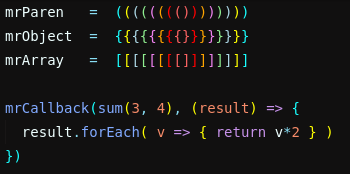

# Bracket Colorizer

[](https://travis-ci.org/vn-ki/bracket-colorizer)

Finding brackets is easier than ever now. This atom extension uniquely colors bracket pairs.

<p align="center">

</p>

## Installation

You can use apm for install.

```
apm install bracket-colorizer
```

## Change Colors

You can customize the colors by adding the following to your [global style sheet](https://flight-manual.atom.io/using-atom/sections/basic-customization/#style-tweaks) and changing the colors.

`.bracket-colorizer-color0` will be used for unmatched closing brackets.
 The numbers 1 - 9 will be repeated. You can change the maximum number that will be repeated in the settings.

```less
atom-text-editor.editor {
  .bracket-colorizer-color0 {
      color: white;
  }
  .bracket-colorizer-color1  {
      color: lighten(teal, 30);
    }
  .bracket-colorizer-color2 {
      color: yellow;
    }
  .bracket-colorizer-color3  {
      color: lightblue;
  }
  .bracket-colorizer-color4  {
      color: lightgreen;
  }
  .bracket-colorizer-color5 {
      color: violet;
  }
  .bracket-colorizer-color6 {
    color: orange;
  }
  .bracket-colorizer-color7 {
    color: red;
  }
  .bracket-colorizer-color8 {
    color: rgb(249, 98, 98);
  }
  .bracket-colorizer-color9 {
      color: rgb(1, 204, 190);
  }
}
```


Based on [nms-color-bracket](https://github.com/nmscholl/nms-color-bracket).

### Breaking changes in 1.0

- In settings, `'{;}, [;], (;)'` format is changed to `'{}, [], ()'`
- The toggle is removed. Package now activates on startup.
